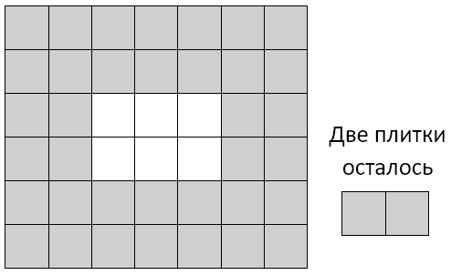

# [G. Площадь](https://contest.yandex.ru/contest/27844/problems/G/)

---
| Ограничение времени  | 0.5 секунды |
| :--- |:---|
| Ограничение памяти     | 64Mb |
| Ввод      | стандартный ввод или input.txt |
| Вывод | стандартный вывод или output.txt |
---
Городская площадь имеет размер n× m и покрыта квадратной плиткой размером 1× 1. При плановой замене плитки выяснилось, что новой плитки недостаточно для покрытия всей площади, поэтому было решено покрыть плиткой только дорожку по краю площади, а в центре площади разбить прямоугольную клумбу (см. рисунок к примеру). При этом дорожка должна иметь одинаковую ширину по всем сторонам площади. Определите максимальную ширину дорожки, которую можно выложить из имеющихся плиток.

---
## Формат ввода
Первая и вторая строки входных данных содержат по одному числу n и m (3≤ n ≤ 2× 10^9, 3≤ m ≤ 2× 10^9) — размеры площади.

Третья строка содержит количество имеющихся плиток t, 1≤ t< nm.

## Формат вывода
Программа должна вывести единственное число — максимальную ширину дорожки, которую можно выложить из имеющихся плиток.

---
## Пример

| Ввод  | Вывод  |
| :---: | :---: |
| 6 | 2 |
| 7 |  |
| 38 |  |

---
### Примечания
Пояснение к примеру. Площадь имеет размеры 6× 7, из 38 плиток можно выложить дорожку шириной в 2 плитки.

